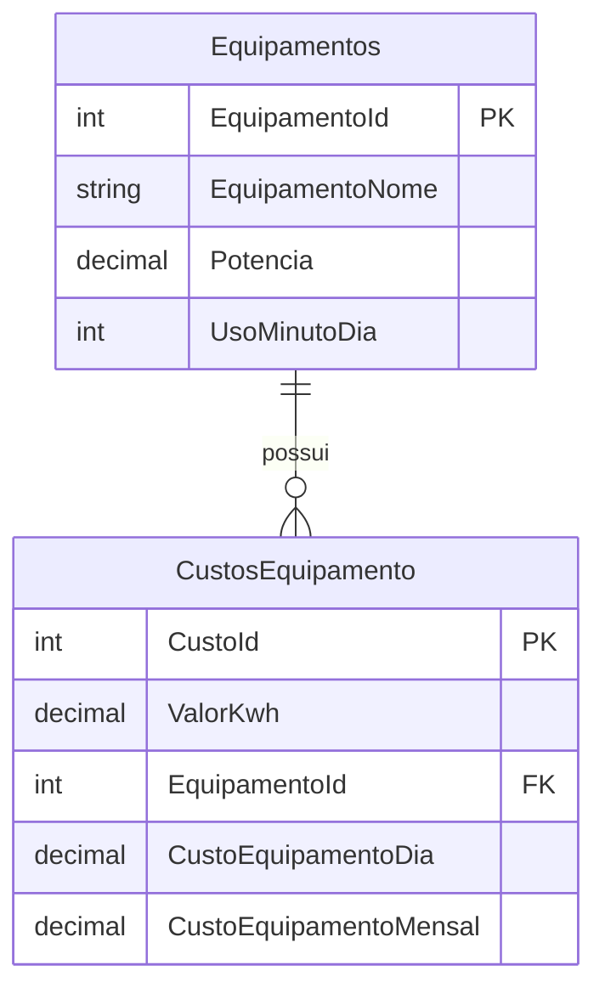

<p align="center">


  <h2 align="center">API para gerenciamento de consumo energético ⚡</h2>
</p>

## ❓ Por quê?
Este projeto foi criado para aperfeiçoar meus conhecimentos em .NET e arquitetura REST API, sendo assim, eu realmente aprecio qualquer feedback que você possa me dar sobre o projeto, o código, a arquitetura, o padrão de design ou qualquer outro ponto que queira reportar — isso me ajuda a me tornar um desenvolvedor melhor.
=======
  <h2 align="center">API para gerenciamento de consumo energético ⚡ (em C# dessa vez)</h2>
</p>

## ❓ Por quê?
Este projeto foi criado para aperfeiçoar meus conhecimentos em .NET e arquitetura REST API, sendo assim, eu realmente aprecio qualquer feedback que você possa me dar sobre o projeto, o código, a arquitetura, o padrão de design ou qualquer outro ponto que queira reportar, isso me ajuda a me tornar um desenvolvedor melhor.
>>>>>>> c53c10da683e7db70cb44f7f48dfd7a5345a562d
Para contribuir com isso, você pode me enviar um e-mail: [dellano.liagi2004@gmail.com](mailto:dellano.liagi2004@gmail.com), se conectar comigo no [LinkedIn](https://www.linkedin.com/in/maurizio-dellano/) ou abrir uma issue aqui [issue](https://github.com/Dellano23/EnergyApi/issues/new).

## ⚖ REST
O objetivo de aplicar REST aqui é basicamente melhorar alguns detalhes no serviço web. REST oferece diversos benefícios, como desempenho e confiabilidade.
<<<<<<< HEAD
Desempenho é um dos fatores que motivam o uso de um aplicativo — quanto maior a velocidade, melhor. Já a confiabilidade é essencial para o serviço, pois outras aplicações irão consumir esta API, e uma comunicação clara entre elas precisa acontecer.
=======
Desempenho é um dos fatores que motivam o uso de um aplicativo, quanto maior a velocidade, melhor. Já a confiabilidade é essencial para o serviço, pois outras aplicações irão consumir esta API, e uma comunicação clara entre elas precisa acontecer.
>>>>>>> c53c10da683e7db70cb44f7f48dfd7a5345a562d

Sobre esta API: ela é separada do cliente e é *stateless* (sem estado). Isso significa que cada requisição é independente. Por exemplo, a rota `api/equipamento` requer um *bearer token* para autenticação. Sendo assim, se um usuário fizer duas requisições para essa rota, ambas devem conter o token.

Tenho certeza de que ainda há detalhes do REST que esta API não segue, ou até mesmo regras que estão sendo quebradas. Ainda estou em processo de aprendizado, que é constante e portanto não me permite corrigir tudo ainda, mas meu foco é total no aprendizado e melhorar cada vez mais meus conhecimentos, para desenvolvimento de soluções cada vez mais completas.
<<<<<<< HEAD
— então, se você identificar algo, me avise (você pode abrir uma issue [aqui](https://github.com/Dellano23/EnergyApi/issues/new)) 😉.
=======
Então, se você identificar algo, me avise (você pode abrir uma issue [aqui](https://github.com/Dellano23/EnergyApi/issues/new)) 😉.
>>>>>>> c53c10da683e7db70cb44f7f48dfd7a5345a562d

## 🔨 Arquitetura

Neste projeto, utilizei a arquitetura MVVM (Model - View - ViewModel) para organizar melhor as responsabilidades e facilitar a manutenção. Os Models representam a estrutura dos dados, os Services concentram as regras de negócio, o Repository é utilizado para acesso direto ao banco, pois neste projeto utilizei Entity Framework Core para transformar objetos C# em entidades relacionais salvas em um Banco de Dados SQLite.

Também temos as ViewModels, que servem para transportar os dados entre a API e o restante da aplicação.

Além disso, utilizei o padrão de injeção de dependência nativo do ASP.NET Core para registrar nossos serviços e repositórios. Dessa forma, conseguimos aplicar o princípio de inversão de dependência, desacoplando os componentes e facilitando a troca ou evolução de suas implementações no futuro. Por exemplo:

```csharp
builder.Services.AddScoped<IEquipamentoRepository, EquipamentoRepository>();
builder.Services.AddScoped<IEquipamentoService, EquipamentoService>();
```

Isso significa que, sempre que algum componente precisar de um `IEquipamentoRepository`, o .NET irá injetar uma instância da classe `EquipamentoRepository`, sem que seja necessário criá-la manualmente. Isso torna a aplicação mais testável, pois podemos facilmente substituir implementações reais por mocks em cenários de teste.

Por fim, utilizei o AutoMapper para automatizar o mapeamento entre as ViewModels e os Models. Isso elimina a necessidade de conversões manuais e reduz a chance de erros de mapeamento, além de manter o código mais limpo.

## Funcionamento
<<<<<<< HEAD
Tendo uma média do valor do kWh — que pode ser obtida dividindo o valor total da conta de luz pelo consumo total de kWh — o usuário, estando devidamente logado no sistema que gera um Bearer token e permite acesso a 3 roles, pode inserir o custo do kWh e o id do equipamento que deseja calcular.
=======
Tendo uma média do valor do kWh, que pode ser obtida dividindo o valor total da conta de luz pelo consumo total de kWh, o usuário, estando devidamente logado no sistema que gera um Bearer token e permite acesso a 3 roles, pode inserir o custo do kWh e o id do equipamento que deseja calcular.
>>>>>>> c53c10da683e7db70cb44f7f48dfd7a5345a562d

Com base no tempo de uso (minutos) registrado na model do equipamento e sua potência em Watts, temos o retorno na API do custo diário e mensal do equipamento.

<p align="center">
  
</p>

Caso a visualização não esteja boa, pode ser acessado o link do vídeo diretamente no YouTube:

https://youtu.be/Ercn9bGk328

## ✅ Banco de dados

<<<<<<< HEAD
O projeto foi ajustado para usar **SQLite** localmente, e não Oracle.
=======
O projeto foi ajustado para usar **SQLite** localmente.
>>>>>>> c53c10da683e7db70cb44f7f48dfd7a5345a562d

- Arquivo de banco: `energy.db`
- Pasta do projeto: `Fiap.Api.Energy` (caminho raiz do projeto)
- Conexão configurada em `appsettings.json`
- Migrations criadas em `Migrations/`
- Migrações aplicadas automaticamente no startup via `db.Database.Migrate()` no `Program.cs`

### Estrutura de tabelas

| Tabela | Campos | Observações |
| --- | --- | --- |
| `Equipamentos` | `EquipamentoId` (PK), `EquipamentoNome`, `Potencia`, `UsoMinutoDia` | Cadastro dos equipamentos que consomem energia |
| `CustosEquipamento` | `CustoId` (PK), `ValorKwh`, `EquipamentoId` (FK), `CustoEquipamentoDia`, `CustoEquipamentoMensal` | Registro de custo por equipamento |

### Relação entre tabelas

- `CustosEquipamento.EquipamentoId` → `Equipamentos.EquipamentoId`
- Um `Equipamento` pode ter vários registros de `CustoEquipamento`
- A exclusão em cascata está definida para manter a integridade do relacionamento

### Diagrama do banco de dados



## 🧭 Como rodar

1. Abra o terminal na pasta do projeto:

```bash
<<<<<<< HEAD
echo cd "c:\Users\della\Downloads\Fiap.Api.Energy\Fiap.Api.Energy"
=======
echo cd "\Fiap.Api.Energy\Fiap.Api.Energy"
>>>>>>> c53c10da683e7db70cb44f7f48dfd7a5345a562d
```

2. Restaure pacotes:

```bash
dotnet restore
```

3. Compile:

```bash
dotnet build
```

4. Execute:

```bash
dotnet run
```

5. Acesse o Swagger para testar:

<<<<<<< HEAD
- `https://localhost:7031/swagger`
=======
>>>>>>> c53c10da683e7db70cb44f7f48dfd7a5345a562d
- `http://localhost:5250/swagger`

## 🔐 Autenticação

- Endpoint de login: `POST /api/Auth/login`
- Exemplo de corpo:

```json
{
<<<<<<< HEAD
  "username": "gerente01",
  "password": "pass123"
=======
  "userId": 3,
  "username": "gerente01",
  "password": "pass123",
  "role": "gerente"
>>>>>>> c53c10da683e7db70cb44f7f48dfd7a5345a562d
}
```

- A resposta retorna um token JWT.
- No Swagger, clique em `Authorize` e use:

```text
Bearer <seu_token_aqui>
```

- A rota `api/custoEquipamento` está protegida com `[Authorize]`
- Alguns endpoints exigem role `gerente`:
  - `PUT /api/CustoEquipamento/{id}`
  - `DELETE /api/CustoEquipamento/{id}`

## 📁 Pastas principais

- `Controllers/` — endpoints da API
- `Services/` — lógica de negócio
- `Data/Contexts/` — `DatabaseContext` e configuração EF
- `Data/Repository/` — acesso aos dados
- `Models/` — entidades do banco
- `ViewModel/` — modelos de entrada/saída para API
- `Migrations/` — migrações EF Core para SQLite

## 🛠️ Observações importantes

<<<<<<< HEAD
- O projeto já foi migrado de Oracle para SQLite.
=======
- O projeto foi migrado de Oracle para SQLite.
>>>>>>> c53c10da683e7db70cb44f7f48dfd7a5345a562d
- O arquivo `energy.db` é local e pode ser aberto com ferramentas como:
  - DB Browser for SQLite
  - extensão SQLite no VS Code
- O startup aplica automaticamente as migrações quando o app inicia.
<<<<<<< HEAD

## 🚀 Testando o banco SQLite visualmente

1. Pare o app se ele estiver em execução.
2. Abra `energy.db` com um visualizador SQLite.
3. Verifique as tabelas `Equipamentos` e `CustosEquipamento`.

Se quiser, posso também adicionar exemplos de payloads JSON completos para cada endpoint no README.
=======
>>>>>>> c53c10da683e7db70cb44f7f48dfd7a5345a562d
